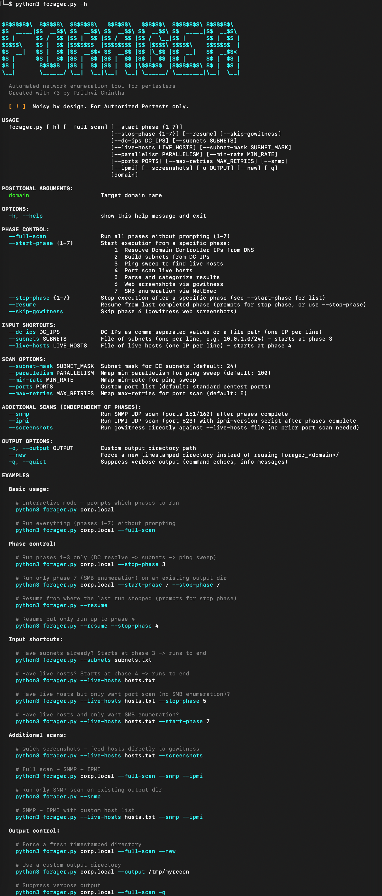

# Forager



Forager automates the full internal recon workflow — from resolving domain controllers to web screenshots and SMB enumeration — in a single, phase-controlled pipeline.

Recommended for **non-stealth engagements** only. This tool generates significant network noise.

---

## Installation

```bash
git clone https://github.com/GheekyByt3/forager.git
cd forager
pip install -r requirements.txt
```

---

## Features

- Phase-based execution — run all 7 phases or pick a range
- Resume from last completed phase
- Input shortcuts — bring your own subnets, live hosts, or DC IPs
- Web screenshots via gowitness (Phase 6 uses parsed results for precision)
- SMB enumeration via NetExec with auto-parsed output files
- Additional scans — `--snmp`, `--ipmi`, `--screenshots` (independent of phases)
- Dynamic OS categorization from nxc output
- Per-phase timing and final summary
- Clean error handling with hints

---

## Requirements

**System tools:**

| Tool | Used in |
|---|---|
| `nslookup` | Phase 1 — DC resolution |
| `nmap` | Phases 3–4 — ping sweep and port scan; `--snmp`, `--ipmi` |
| `gowitness` | Phase 6 — web screenshots (optional, skipped if not installed); `--screenshots` |
| `nxc` (NetExec) | Phase 7 — SMB enumeration |

**Python:**
- Python 3.7+
- `pyfiglet` (optional — falls back to built-in ASCII banner if not installed)

Install Python dependencies:

```bash
pip install -r requirements.txt
```

---

## Usage

```
python3 forager.py [domain] [options]
```

### Basic

```bash
# Interactive mode — prompts which phases to run
python3 forager.py corp.local

# Run all phases without prompting
python3 forager.py corp.local --full-scan
```

### Phase control

```bash
# Run phases 1–3 only (DC resolve → subnets → ping sweep)
python3 forager.py corp.local --stop-phase 3

# Run only phase 7 (SMB enumeration) on an existing output dir
python3 forager.py corp.local --start-phase 7 --stop-phase 7

# Resume from where the last run stopped (prompts for stop phase)
python3 forager.py --resume

# Resume but only run up to phase 4
python3 forager.py --resume --stop-phase 4

# Full scan but skip gowitness screenshots
python3 forager.py corp.local --full-scan --skip-gowitness
```

### Input shortcuts

```bash
# Have subnets already? Starts at phase 3
python3 forager.py --subnets subnets.txt

# Have live hosts? Starts at phase 4
python3 forager.py --live-hosts hosts.txt

# Have live hosts but only want port scan + parse (no screenshots/SMB)?
python3 forager.py --live-hosts hosts.txt --stop-phase 5

# Have live hosts and only want SMB enumeration?
python3 forager.py --live-hosts hosts.txt --start-phase 7
```

### Additional scans

These run independently of the phase system — after phases complete, or standalone.

```bash
# Quick screenshots — feed hosts directly to gowitness (no port scan needed)
python3 forager.py --live-hosts hosts.txt --screenshots

# Full scan + SNMP + IPMI
python3 forager.py corp.local --full-scan --snmp --ipmi

# Run only SNMP scan on existing output dir
python3 forager.py --snmp

# SNMP + IPMI with custom host list
python3 forager.py --live-hosts hosts.txt --snmp --ipmi
```

### Output control

```bash
# Force a fresh timestamped directory
python3 forager.py corp.local --full-scan --new

# Use a custom output directory
python3 forager.py corp.local --output /tmp/myrecon

# Suppress verbose output
python3 forager.py corp.local --full-scan -q
```

---

## Phases

| # | Phase | Tool |
|---|---|---|
| 1 | Resolve Domain Controller IPs from DNS (SRV records) | nslookup |
| 2 | Build subnets from DC IPs | — |
| 3 | Ping sweep to find live hosts | nmap |
| 4 | Port scan live hosts | nmap |
| 5 | Parse and categorize results | — |
| 6 | Web screenshots via gowitness | gowitness (optional) |
| 7 | SMB enumeration via NetExec | nxc |

**Additional scans** (not phases — opt-in via flags):

| Flag | Scan | Tool |
|---|---|---|
| `--snmp` | SNMP UDP scan (ports 161/162) | nmap |
| `--ipmi` | IPMI UDP scan (port 623) with version detection | nmap |
| `--screenshots` | Direct gowitness scan against `--live-hosts` file | gowitness |

---

## Output Structure

```
forager_corp.local/
├── DC_IPs.txt                        # Resolved DC IP addresses
├── DC_subnets.txt                    # Generated subnets
├── live_hosts.txt                    # Hosts that responded to ping
├── ping_sweep.gnmap                  # Raw nmap ping sweep output
├── .forager_state.json               # State file for --resume
├── nmap_scans/
│   ├── port_scan.nmap
│   ├── port_scan.xml
│   ├── port_scan.gnmap
│   ├── snmp_scan.*                   # Only if --snmp was used
│   └── ipmi_hosts_scan.*            # Only if --ipmi was used
├── parsed_results/
│   ├── full_summary.csv              # All open ports across all hosts
│   ├── web_hosts.txt
│   ├── rdp_hosts.txt
│   ├── ssh_hosts.txt
│   ├── smb_hosts.txt
│   ├── winrm_hosts.txt
│   ├── ldap_hosts.txt
│   ├── redis_hosts.txt
│   ├── snmp_hosts.txt                # Only if --snmp was used
│   ├── ipmi_hosts.txt                # Only if --ipmi was used
│   └── ...
├── gowitness_results/                # Only if phase 6 or --screenshots ran
│   ├── target_urls.txt               # Phase 6: URLs built from parsed results
│   ├── gowitness.sqlite3             # Gowitness database
│   └── screenshots/                  # Captured web screenshots
└── nxc_smb_parsed_results/
    ├── smb_connection_scan.txt       # Raw nxc output
    ├── smb_signing_disabled_hosts.txt
    ├── smb_relay_targets.txt         # smb://IP format
    ├── smbv1_enabled_hosts.txt
    └── Windows_<version>_hosts.txt   # One file per OS version detected
```

---

## Options Reference

```
positional:
  domain                Target domain name

phase control:
  --full-scan           Run all phases without prompting (1-7)
  --start-phase {1-7}   Start from a specific phase
  --stop-phase {1-7}    Stop after a specific phase
  --resume              Resume from last completed phase
  --skip-gowitness      Skip phase 6 (gowitness web screenshots)

input shortcuts:
  --dc-ips              DC IPs as comma-separated values or file path
  --subnets             File of subnets (one per line) — starts at phase 3
  --live-hosts          File of live hosts (one IP per line) — starts at phase 4

scan options:
  --subnet-mask         Subnet mask for DC subnets (default: 24)
  --parallelism         Nmap min-parallelism for ping sweep (default: 100)
  --min-rate            Nmap min-rate for ping sweep
  --ports               Custom port list
  --max-retries         Nmap max-retries for port scan (default: 5)

additional scans:
  --snmp                Run SNMP UDP scan (ports 161/162)
  --ipmi                Run IPMI UDP scan (port 623) with ipmi-version script
  --screenshots         Run gowitness directly against --live-hosts file

output options:
  -o, --output          Custom output directory path
  --new                 Force a new timestamped directory
  -q, --quiet           Suppress verbose output
```

---

## Disclaimer

This tool is intended for **authorized penetration testing and security assessments only**. Unauthorized use against systems you do not own or have explicit written permission to test is illegal. The author assumes no liability for misuse.

---

## License

MIT — see [LICENSE](LICENSE)

---

## Changelog

See [CHANGELOG.md](CHANGELOG.md)
